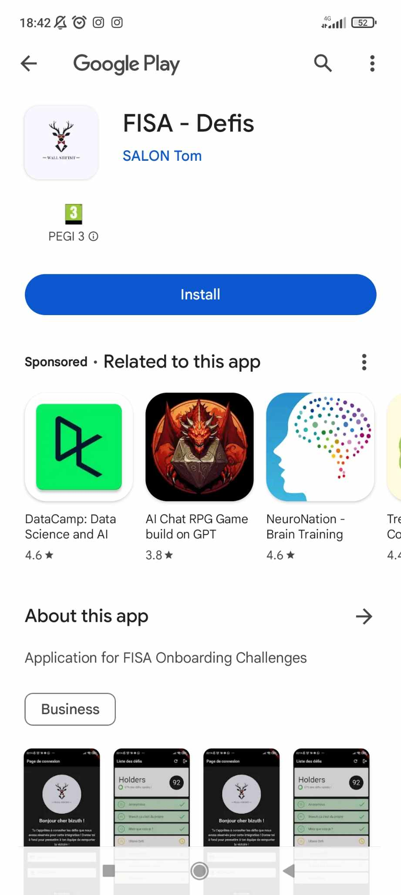
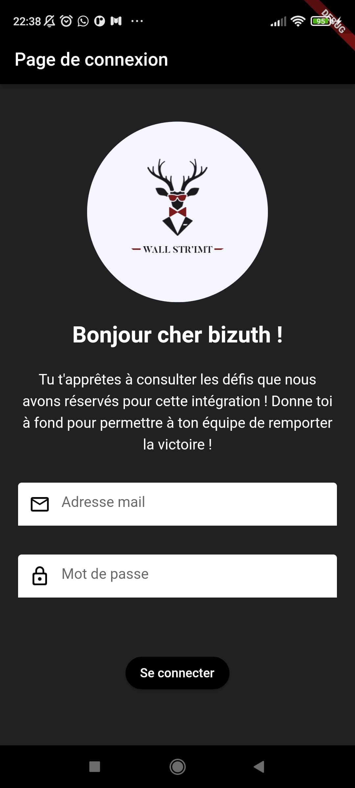
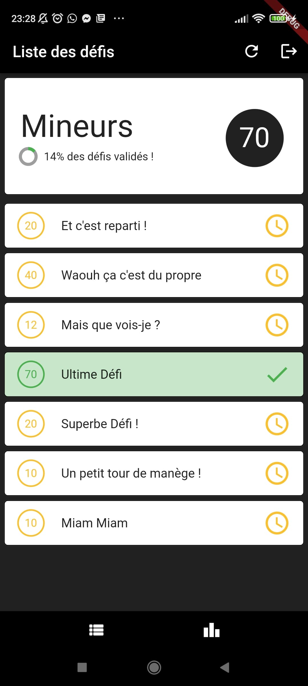
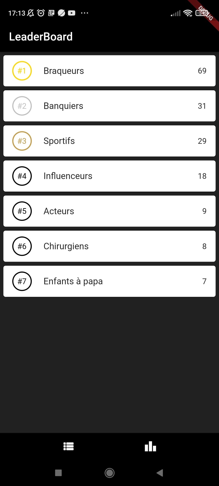
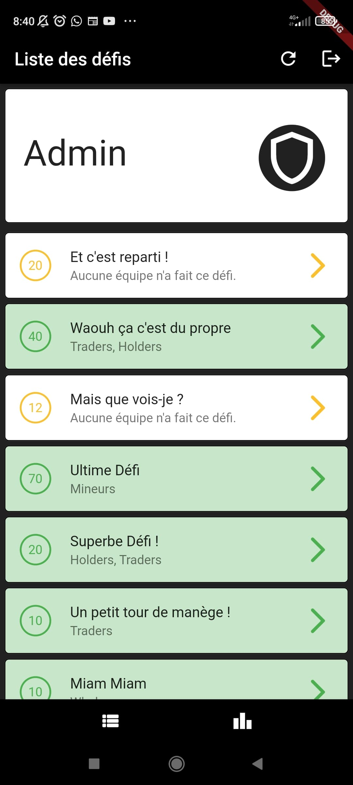

# Challenges App for Student Integration - Flutter, Firebase

Student project for displaying a list of challenges for integration.

## User view (non-admin)

Each member of the team has access to the list of challenges. It displays the name, the points for each task, and whether the team completed it or not. If the user wants more details, they can click on the tile, and a screen will display more information.

Once the team thinks a challenge is done, the members have to send the proofs via messenger to the admin team for confirmation and point allocation.

## Admin view

Everyone in the admin team has access to an administration screen displaying the following information for each challenge:

* The name
* The points
* The teams that completed the challenge

They also have access to a configuration screen for each challenge to modify the points and validate the challenge for a team.